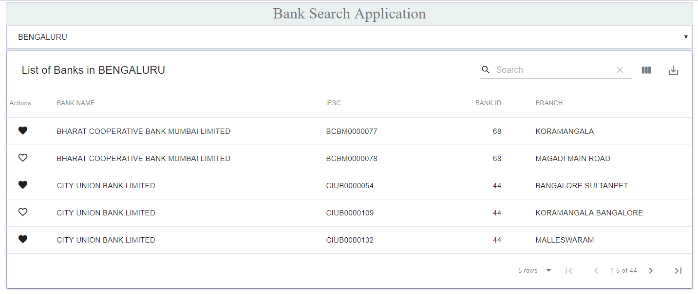

## BANK SEARCH APPLICATION

This project was built using [Create React App](https://github.com/facebook/create-react-app).

## Description

User interface that allows a user to search the bank details of the 5 cities (i.e Benagaluru, Delhi, Chennai, Mumbai, Pune). 

There is dropdown at the top to select the city which they wants to search the details of the banks. By default this application will be showing the table which has details of the banks available in Bengaluru. 

Initially when the application gets loaded only Bank Name, IFSC, Bank ID, Branch Name columns will be visible on the screen. If the user wants to see other details such as address, state etc. Then there is a button next to search option which lets the user to add or remove the column details from the table.

User can search for a specific details across the columns , also sort using columns. 

This application lets the user to export the details of the current page in CSV format.

User can also be able to select the number of items to display in the current page, default it will be set to 5. 

API responses are cached using axios-cache-adapter.

Application lets the user to add or remove the bank details as favorite from the list.

## Getting Started

These instructions will get you a copy of the project up and running on your local machine for development and testing purposes. See deployment for notes on how to deploy the project on a live system.

https://vast-shore-74260.herokuapp.com/banks?city=BENGALURU, is the API used to fetch the details of the banks.

## Prerequisites
### `Below are the prequisites required to run this application:`

     1.Node - You can install the node using [NODE](https://nodejs.org/en/).
     2.NPM - You can get the latest npm using [NPM](https://www.npmjs.com/get-npm).
     3.GIT - Git is required to clone this particular project and to use it in your local machine. You can install git using 
     [GIT](https://github.com/).

### `Frameworks and libraries required to run this applications are:`
  
     1.Install React and react dom.
             use these commands to install react and react-dom - npm install react --save , npm install react-dom --save.
     2.Install axios.
             use the command npm install axios --save to install it.
     3.Install material-table.
             use the command npm install material-table --save to install it.
     4.Install axios-cache-adapter.
             use the command npm install --save axios-cache-adapter to install it.
        
Once all the installation completed. Run npm start in the project directory, once the npm start finishes open the 
[http://localhost:3000](http://localhost:3000) to view the application in the browser.

### Deployment

You can learn more about deployment in the [Deployment](https://facebook.github.io/create-react-app/docs/deployment).
I have done the deployment using surge, link - [Bank Search App](http://bank-search.surge.sh).

Screenshot of the loan calculator app :

## Available Scripts

In the project directory, you can run:

### `npm start`

Runs the app in the development mode. 
Open [http://localhost:3000](http://localhost:3000) to view it in the browser.

The page will reload if you make edits. 
You will also see any lint errors in the console.

### `npm test`

Launches the test runner in the interactive watch mode. 
See the section about [running tests](https://facebook.github.io/create-react-app/docs/running-tests) for more information.

### `npm run build`

Builds the app for production to the `build` folder. 
It correctly bundles React in production mode and optimizes the build for the best performance.

The build is minified and the filenames include the hashes. 
Your app is ready to be deployed!

See the section about [deployment](https://facebook.github.io/create-react-app/docs/deployment) for more information.

### `npm run eject`

**Note: this is a one-way operation. Once you `eject`, you can’t go back!**

If you aren’t satisfied with the build tool and configuration choices, you can `eject` at any time. This command will remove the single build dependency from your project.

Instead, it will copy all the configuration files and the transitive dependencies (Webpack, Babel, ESLint, etc) right into your project so you have full control over them. All of the commands except `eject` will still work, but they will point to the copied scripts so you can tweak them. At this point you’re on your own.

You don’t have to ever use `eject`. The curated feature set is suitable for small and middle deployments, and you shouldn’t feel obligated to use this feature. However we understand that this tool wouldn’t be useful if you couldn’t customize it when you are ready for it.

## Learn More

You can learn more in the [Create React App documentation](https://facebook.github.io/create-react-app/docs/getting-started).

To learn React, check out the [React documentation](https://reactjs.org/).

### Code Splitting

This section has moved here: https://facebook.github.io/create-react-app/docs/code-splitting

### Analyzing the Bundle Size

This section has moved here: https://facebook.github.io/create-react-app/docs/analyzing-the-bundle-size

### Making a Progressive Web App

This section has moved here: https://facebook.github.io/create-react-app/docs/making-a-progressive-web-app

### Advanced Configuration

This section has moved here: https://facebook.github.io/create-react-app/docs/advanced-configuration

### Deployment

This section has moved here: https://facebook.github.io/create-react-app/docs/deployment

### `npm run build` fails to minify

This section has moved here: https://facebook.github.io/create-react-app/docs/troubleshooting#npm-run-build-fails-to-minify

## Author
Kavya H L : kavyahl1234@gmail.com